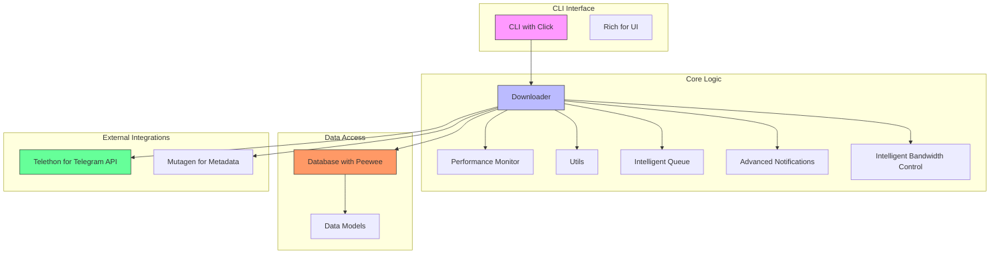
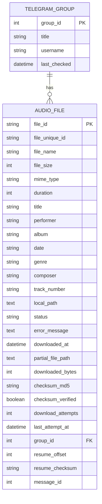
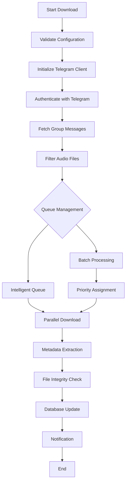

# Telegram Audio Downloader - Enhancement Design Document

## 1. Overview

### 1.1 Project Description
The Telegram Audio Downloader is a powerful, asynchronous Python tool for downloading and managing audio files from Telegram channels and groups. It features performance monitoring, fuzzy search capabilities, and Docker support for cross-platform compatibility.

### 1.2 Current Features
- Asynchronous downloads with rate limiting
- Advanced fuzzy search and filtering
- Audio metadata extraction and management
- Performance monitoring and metrics
- Docker support with multi-stage builds
- Robust error handling and retry mechanisms
- SQLite database for download tracking
- Rich CLI interface with progress bars

### 1.3 Enhancement Goals
This design document outlines improvements and extensions to the Telegram Audio Downloader to enhance functionality, performance, and user experience.

## 2. Architecture

### 2.1 System Components


### 2.2 Component Responsibilities

#### 2.2.1 CLI Component
- User input handling through Click framework
- Command orchestration
- Output formatting with Rich library
- Configuration loading and validation

#### 2.2.2 Downloader Component
- Telegram API communication via Telethon
- Audio file downloading with resume capability
- Parallel download management
- Metadata extraction using Mutagen
- Integration with performance monitoring

#### 2.2.3 Database Component
- SQLite database management with Peewee ORM
- Audio file and group metadata storage
- Download status tracking
- Resume information persistence

#### 2.2.4 Performance Component
- Memory usage monitoring
- CPU utilization tracking
- Download speed metrics
- Resource optimization

#### 2.2.5 Intelligent Queue Component
- Download prioritization
- Batch processing management
- Queue optimization algorithms

#### 2.2.6 Advanced Notifications Component
- Download completion notifications
- Error notifications
- Progress updates
- Multi-channel notification support

#### 2.2.7 Intelligent Bandwidth Control Component
- Dynamic bandwidth allocation
- Rate limiting based on network conditions
- Concurrent download optimization

## 3. Data Models & ORM Mapping

### 3.1 Entity Relationship Diagram


### 3.2 Model Definitions

#### 3.2.1 TelegramGroup Model
- `group_id`: Unique identifier for the Telegram group
- `title`: Group title
- `username`: Group username (if available)
- `last_checked`: Timestamp of last group scan

#### 3.2.2 AudioFile Model
- `file_id`: Unique Telegram file identifier
- `file_unique_id`: Globally unique file identifier
- `file_name`: Name of the audio file
- `file_size`: Size of the file in bytes
- `mime_type`: MIME type of the file
- `duration`: Audio duration in seconds
- `title`: Audio title from metadata
- `performer`: Audio performer/artist
- `album`: Album name
- `date`: Creation date
- `genre`: Music genre
- `composer`: Composer name
- `track_number`: Track number
- `local_path`: Local file path after download
- `status`: Download status (pending, downloading, completed, failed, skipped)
- `error_message`: Error details if download failed
- `downloaded_at`: Timestamp when download completed
- `partial_file_path`: Path to partially downloaded file
- `downloaded_bytes`: Number of bytes downloaded
- `checksum_md5`: MD5 checksum for file integrity
- `checksum_verified`: Flag indicating if checksum was verified
- `download_attempts`: Number of download attempts
- `last_attempt_at`: Timestamp of last download attempt
- `group_id`: Foreign key to TelegramGroup
- `resume_offset`: Byte offset for resume functionality
- `resume_checksum`: Checksum for resume validation
- `message_id`: Telegram message identifier

## 4. API Endpoints Reference

### 4.1 CLI Commands

#### 4.1.1 Download Command
```
telegram-audio-downloader download [OPTIONS] GROUP
```

**Options:**
- `-l, --limit INTEGER`: Maximum number of files to download
- `-o, --output PATH`: Output directory
- `-p, --parallel INTEGER`: Number of parallel downloads
- `-t, --filename-template TEXT`: Custom filename template
- `-i, --interactive`: Enable interactive mode

**Example:**
```bash
telegram-audio-downloader download @musicgroup --limit=50 --parallel=5 --output=./music
```

#### 4.1.2 Search Command
```
telegram-audio-downloader search [OPTIONS] [QUERY]
```

**Options:**
- `--fuzzy`: Enable fuzzy search
- `--format [mp3|m4a|flac|ogg|wav]`: Filter by audio format
- `--min-size TEXT`: Minimum file size
- `--max-size TEXT`: Maximum file size
- `--group TEXT`: Filter by group

**Example:**
```bash
telegram-audio-downloader search "beethoven" --fuzzy --format=flac --min-size=10MB
```

#### 4.1.3 Performance Command
```
telegram-audio-downloader performance [OPTIONS]
```

**Options:**
- `--watch`: Enable real-time monitoring

**Example:**
```bash
telegram-audio-downloader performance --watch
```

### 4.2 Configuration

#### 4.2.1 Environment Variables (.env)
```env
# Telegram API credentials (required)
API_ID=1234567
API_HASH=your_api_hash_here
SESSION_NAME=my_telegram_session

# Optional settings
DB_PATH=data/downloader.db
MAX_CONCURRENT_DOWNLOADS=3
DEFAULT_DOWNLOAD_DIR=downloads
LOG_LEVEL=INFO
```

#### 4.2.2 Configuration File (config/default.ini)
```ini
[downloads]
max_concurrent = 3
chunk_size = 1048576
retry_attempts = 3
retry_delay = 5

[performance]
max_memory_mb = 1024
rate_limit_requests_per_second = 1.0
rate_limit_burst_size = 5

[metadata]
extract_extended = true
verify_checksums = true
update_id3_tags = true
```

## 5. Business Logic Layer

### 5.1 Download Process Flow


### 5.2 Key Features Implementation

#### 5.2.1 Parallel Download Management
The system implements a semaphore-based approach to control concurrent downloads:
- Configurable maximum concurrent downloads
- Adaptive parallelism based on system resources
- Rate limiting to prevent Telegram API throttling

#### 5.2.2 Resume Functionality
- Tracks download progress in database
- Stores partial file information
- Validates file integrity before resuming
- Handles network interruptions gracefully

#### 5.2.3 Metadata Extraction
- Extracts ID3 tags from audio files
- Stores comprehensive metadata in database
- Supports multiple audio formats
- Extended metadata from external sources

#### 5.2.4 Intelligent Queue Management
- Priority-based download queue with four priority levels (LOW, NORMAL, HIGH, CRITICAL)
- Batch processing capabilities with progress tracking
- Dependency management between download tasks
- Dynamic queue optimization using heap-based sorting
- Resource-aware scheduling with semaphore-based concurrency control

#### 5.2.5 Bandwidth Control
- Dynamic bandwidth allocation
- Network condition monitoring
- Adaptive rate limiting
- Concurrent download optimization

## 6. Error Handling & Recovery

### 6.1 Error Types
- **Authentication Errors**: Invalid API credentials
- **Network Errors**: Connection timeouts, rate limits
- **File Errors**: Permission issues, disk space
- **Telegram API Errors**: Flood wait, RPC errors
- **Database Errors**: Connection issues, integrity errors

### 6.2 Recovery Mechanisms
- Exponential backoff for retry attempts
- Automatic resume for interrupted downloads
- Graceful degradation during API limits
- Error logging and reporting

## 7. Performance Optimization

### 7.1 Memory Management
- LRU cache for downloaded files tracking
- Memory-efficient data structures
- Automatic garbage collection
- Memory usage monitoring

### 7.2 Network Optimization
- Chunked downloads for better throughput
- Connection pooling
- Adaptive chunk sizes
- Network condition monitoring

### 7.3 Database Optimization
- Indexed queries for faster lookups
- Batch database operations
- Connection pooling
- Efficient data serialization

## 8. Testing Strategy

### 8.1 Unit Tests
- Test individual components in isolation
- Mock external dependencies
- Validate data transformations
- Verify error handling

### 8.2 Integration Tests
- Test component interactions
- Validate end-to-end workflows
- Test database operations
- Verify API integrations

### 8.3 Performance Tests
- Measure download speeds
- Test concurrent download limits
- Validate memory usage
- Benchmark search performance

### 8.4 Queue Management Tests
- Test priority-based queue processing
- Validate batch processing functionality
- Test dependency management between tasks
- Verify resource allocation and semaphore control
- Test error handling in queue operations

## 9. Security Considerations

### 9.1 Data Protection
- Secure storage of API credentials
- File access control
- Data encryption at rest
- Secure communication with Telegram API

### 9.2 Input Validation
- Command-line argument validation
- Configuration file validation
- File path sanitization
- Metadata sanitization

### 9.3 Audit Logging
- Track user actions
- Log security events
- Monitor file access
- Record configuration changes