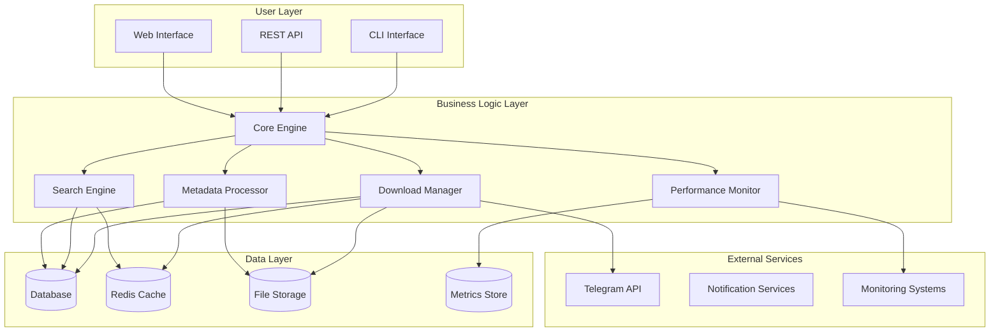
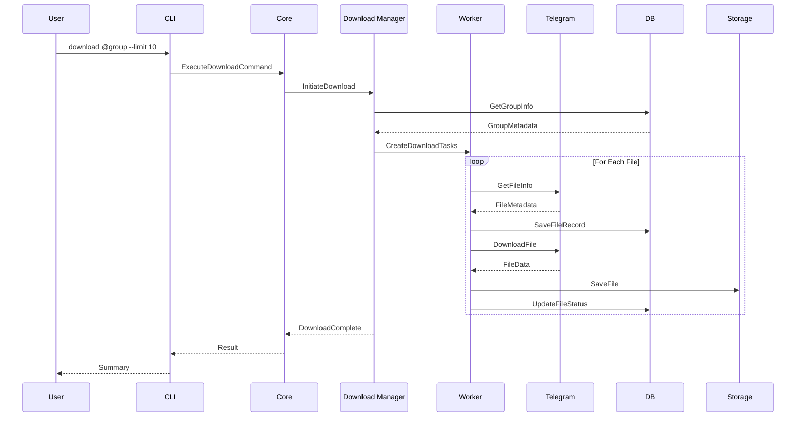
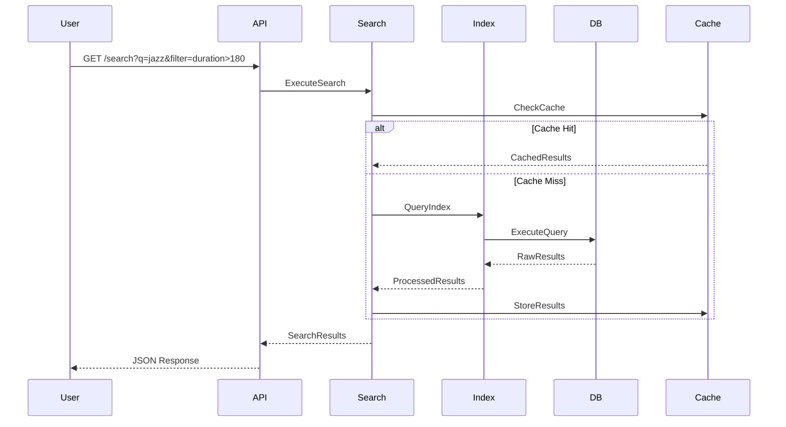
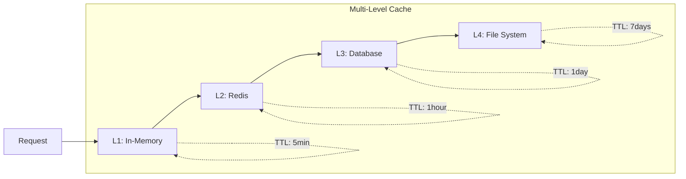
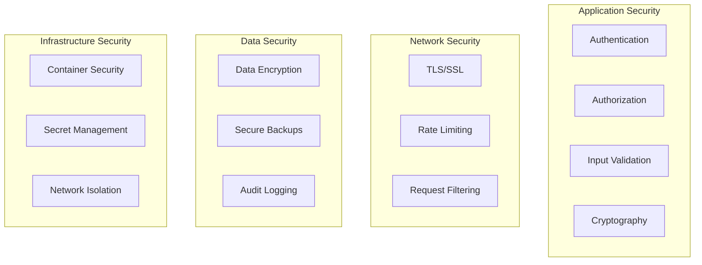
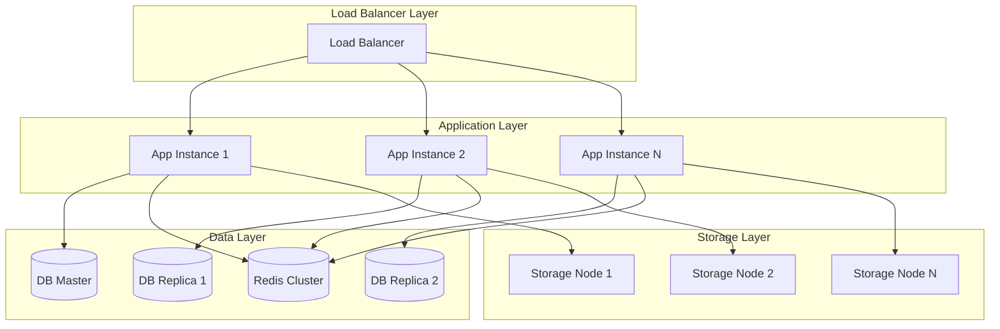
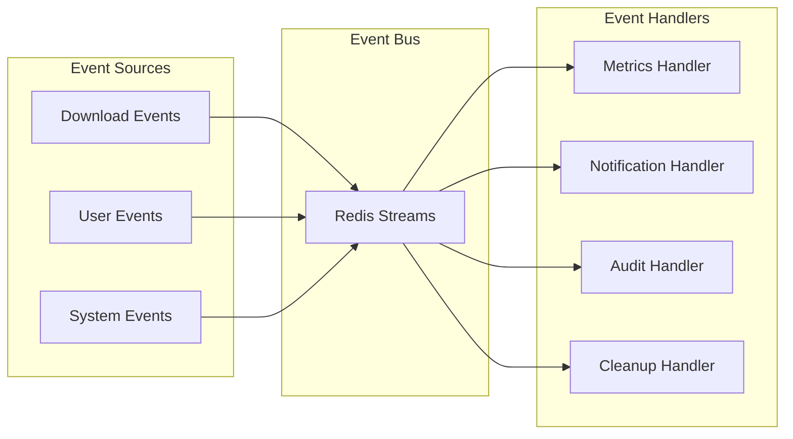
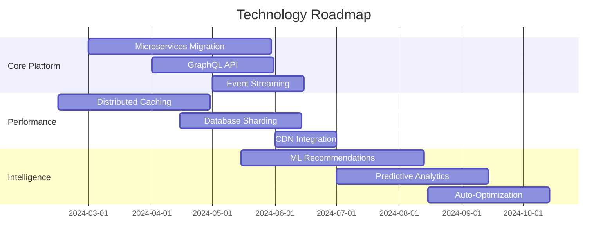

# 🏗️ Project Architecture - Telegram Audio Downloader

**Version:** 1.0.0  
**Updated:** 2024-01-20  
**Document Type:** Technical Architecture Specification

## 📋 Table of Contents

1. [System Overview](#system-overview)
2. [Architecture Components](#architecture-components)
3. [Data Flow & Processing](#data-flow--processing)
4. [Technology Stack](#technology-stack)
5. [Performance Architecture](#performance-architecture)
6. [Security Architecture](#security-architecture)
7. [Scalability Design](#scalability-design)
8. [Integration Patterns](#integration-patterns)

---

## 🔍 System Overview

### Vision Statement
Create a **world-class, enterprise-grade audio downloading system** that sets the gold standard for Telegram bot automation, performance, and code quality.

### Core Architecture Principles

1. **Modular Design**: Loosely coupled, highly cohesive components
2. **Async-First**: Built for high-concurrency and non-blocking operations
3. **Testable**: 90%+ test coverage with comprehensive integration tests
4. **Observable**: Full logging, metrics, and monitoring integration
5. **Secure**: Security-by-design with audit trails and validation
6. **Scalable**: Horizontal and vertical scaling capabilities

### High-Level Architecture



---

## 🏗️ Architecture Components

### 1. Core Engine (`src/telegram_audio_downloader/core/`)

**Purpose**: Central orchestration and business logic coordination

**Key Components**:
- `engine.py` - Main orchestration engine
- `coordinator.py` - Task coordination and scheduling
- `state_manager.py` - Application state management
- `config_manager.py` - Configuration management

```python
# Architecture Pattern: Command Pattern + Observer
class CoreEngine:
    def __init__(self):
        self.download_manager = DownloadManager()
        self.search_engine = SearchEngine()
        self.metadata_processor = MetadataProcessor()
        self.performance_monitor = PerformanceMonitor()
        self.observers = []
    
    async def execute_command(self, command: Command) -> Result:
        # Centralized command execution with monitoring
        pass
```

### 2. Download Manager (`src/telegram_audio_downloader/download/`)

**Purpose**: High-performance, concurrent download orchestration

**Key Components**:
- `manager.py` - Download coordination
- `worker.py` - Individual download workers
- `queue.py` - Download queue management
- `rate_limiter.py` - API rate limiting
- `retry_handler.py` - Intelligent retry logic

```python
# Architecture Pattern: Worker Pool + Circuit Breaker
class DownloadManager:
    def __init__(self, max_workers: int = 8):
        self.worker_pool = WorkerPool(max_workers)
        self.circuit_breaker = CircuitBreaker()
        self.rate_limiter = AdaptiveRateLimiter()
```

### 3. Search Engine (`src/telegram_audio_downloader/search/`)

**Purpose**: Advanced search and filtering capabilities

**Key Components**:
- `engine.py` - Search orchestration
- `indexer.py` - Content indexing
- `filters.py` - Advanced filtering
- `fuzzy_search.py` - Fuzzy matching algorithms
- `query_parser.py` - Query language parsing

### 4. Metadata Processor (`src/telegram_audio_downloader/metadata/`)

**Purpose**: Audio metadata extraction and enhancement

**Key Components**:
- `extractor.py` - Metadata extraction
- `enhancer.py` - Metadata enhancement
- `validator.py` - Data validation
- `normalizer.py` - Data normalization

### 5. Data Access Layer (`src/telegram_audio_downloader/data/`)

**Purpose**: Unified data access with caching and optimization

**Key Components**:
- `repository.py` - Repository pattern implementation
- `cache.py` - Multi-level caching
- `migrations.py` - Database migrations
- `backup.py` - Data backup utilities

---

## 🔄 Data Flow & Processing

### Download Flow Architecture



### Search Flow Architecture



---

## 💻 Technology Stack

### Core Technologies

| Layer | Technology | Version | Purpose |
|-------|------------|---------|---------|
| **Runtime** | Python | 3.11+ | Primary language |
| **Async Framework** | asyncio | 3.11+ | Concurrency handling |
| **HTTP Client** | aiohttp | 3.8+ | Async HTTP operations |
| **Database** | SQLite/PostgreSQL | Latest | Data persistence |
| **Cache** | Redis | 7.0+ | High-speed caching |
| **Message Queue** | Redis Streams | 7.0+ | Task queuing |

### Quality & Testing

| Category | Technology | Purpose |
|----------|------------|---------|
| **Testing** | pytest + pytest-asyncio | Unit/Integration testing |
| **Coverage** | pytest-cov + codecov | Code coverage tracking |
| **Linting** | ruff + flake8 + pylint | Code quality |
| **Formatting** | black + isort | Code formatting |
| **Type Checking** | mypy | Static type checking |
| **Security** | bandit + safety | Security scanning |

### Monitoring & Observability

| Component | Technology | Purpose |
|-----------|------------|---------|
| **Metrics** | Prometheus | Metrics collection |
| **Logging** | structlog | Structured logging |
| **Tracing** | OpenTelemetry | Distributed tracing |
| **Alerting** | Alertmanager | Alert management |
| **Dashboards** | Grafana | Visualization |

---

## ⚡ Performance Architecture

### Concurrency Model

```python
# High-Performance Async Architecture
class PerformanceOptimizedDownloader:
    def __init__(self):
        # Connection pooling
        self.session_pool = aiohttp.TCPConnector(
            limit=100,
            limit_per_host=20,
            enable_cleanup_closed=True
        )
        
        # Worker management
        self.worker_semaphore = asyncio.Semaphore(16)
        self.rate_limiter = TokenBucket(
            rate=2.0,  # tokens per second
            capacity=10
        )
        
        # Memory management
        self.memory_monitor = MemoryMonitor(
            max_memory_mb=2048,
            cleanup_threshold=0.8
        )
```

### Caching Strategy



### Resource Management

- **Memory**: Adaptive memory management with cleanup thresholds
- **CPU**: Worker pool sizing based on CPU cores
- **Network**: Connection pooling and keep-alive
- **Disk**: Async I/O with chunked reading/writing
- **Database**: Connection pooling and prepared statements

---

## 🔒 Security Architecture

### Security Layers



### Security Controls

1. **API Security**:
   - API key authentication
   - Rate limiting per user/IP
   - Input validation and sanitization
   - Output encoding

2. **Data Protection**:
   - Encryption at rest (AES-256)
   - Encryption in transit (TLS 1.3)
   - Secure key management
   - Regular security audits

3. **Access Control**:
   - Role-based access control (RBAC)
   - Principle of least privilege
   - Session management
   - Audit trails

---

## 📈 Scalability Design

### Horizontal Scaling



### Scaling Strategies

1. **Application Scaling**:
   - Stateless application design
   - Container-based deployment
   - Auto-scaling based on metrics
   - Circuit breaker patterns

2. **Database Scaling**:
   - Read replicas for query distribution
   - Sharding for large datasets
   - Connection pooling
   - Query optimization

3. **Storage Scaling**:
   - Distributed file storage
   - CDN integration
   - Compression algorithms
   - Cleanup policies

---

## 🔌 Integration Patterns

### External Service Integration

```python
# Integration Pattern: Adapter + Circuit Breaker
class TelegramAPIAdapter:
    def __init__(self):
        self.circuit_breaker = CircuitBreaker(
            failure_threshold=5,
            recovery_timeout=60,
            expected_exception=TelegramAPIError
        )
        self.retry_policy = ExponentialBackoff(
            initial_delay=1.0,
            max_delay=30.0,
            max_retries=3
        )
    
    @circuit_breaker
    @retry_policy
    async def download_file(self, file_id: str) -> bytes:
        # Implementation with resilience patterns
        pass
```

### Event-Driven Architecture



### API Design Patterns

1. **RESTful API**:
   - Resource-oriented design
   - HTTP status codes
   - JSON responses
   - Pagination support

2. **GraphQL Support**:
   - Flexible data fetching
   - Type-safe queries
   - Real-time subscriptions
   - Introspection

3. **WebSocket Integration**:
   - Real-time updates
   - Progress notifications
   - Event streaming
   - Connection management

---

## 📊 System Metrics & KPIs

### Performance Metrics

| Metric | Target | Monitoring |
|--------|--------|------------|
| **Download Speed** | 10+ MB/s | Real-time |
| **Success Rate** | 99.5%+ | Continuous |
| **Response Time** | <100ms | Real-time |
| **Memory Usage** | <2GB | Continuous |
| **CPU Usage** | <70% | Continuous |
| **Error Rate** | <0.5% | Continuous |

### Business Metrics

| Metric | Target | Period |
|--------|--------|--------|
| **Files Downloaded** | 1M+/month | Monthly |
| **Active Users** | 10K+/month | Monthly |
| **Data Processed** | 10TB+/month | Monthly |
| **Uptime** | 99.9%+ | Monthly |
| **User Satisfaction** | 4.5+/5 | Quarterly |

---

## 🚀 Future Architecture Evolution

### Planned Enhancements

1. **Microservices Migration**:
   - Service decomposition
   - API gateway implementation
   - Service mesh integration
   - Distributed tracing

2. **Machine Learning Integration**:
   - Content recommendation
   - Quality prediction
   - Anomaly detection
   - Performance optimization

3. **Cloud-Native Features**:
   - Kubernetes deployment
   - Serverless functions
   - Auto-scaling
   - Multi-region deployment

### Technology Roadmap



---

*This architecture document serves as the foundation for building a world-class, enterprise-grade system that will set the standard for excellence in the domain.*

---

*Last updated: 2024-01-20*  
*Version: 1.0.0*