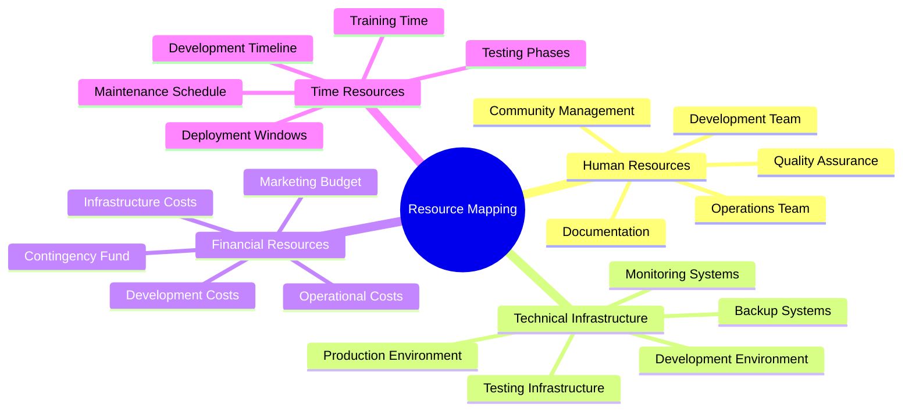
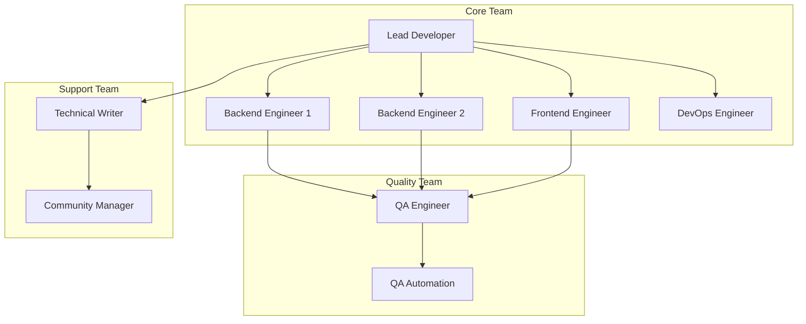
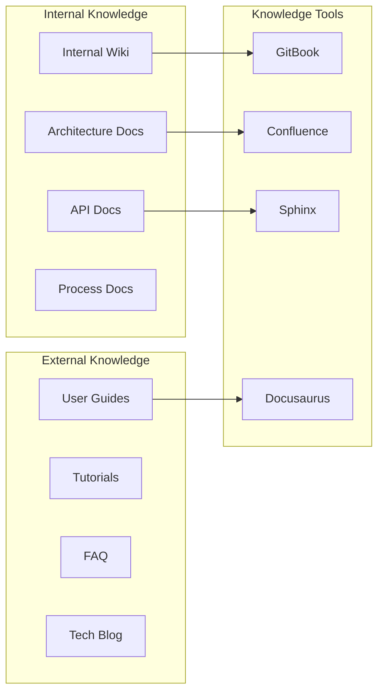

# 💰 Resource Mapping & Planning - Telegram Audio Downloader

**Version:** 1.0.0  
**Updated:** 2024-01-20  
**Document Type:** Resource Planning & Budget Specification

## 📋 Table of Contents

1. [Resource Overview](#resource-overview)
2. [Human Resources](#human-resources)
3. [Technical Infrastructure](#technical-infrastructure)
4. [Development Resources](#development-resources)
5. [Operational Resources](#operational-resources)
6. [Budget Planning](#budget-planning)
7. [Resource Optimization](#resource-optimization)
8. [Scaling Scenarios](#scaling-scenarios)

---

## 🔍 Resource Overview

### Resource Categories



### Resource Allocation Matrix

| Resource Type | Current Allocation | Optimal Allocation | Gap Analysis |
|---------------|-------------------|-------------------|--------------|
| **Development** | 60% | 50% | -10% (Overallocated) |
| **Testing/QA** | 15% | 25% | +10% (Underallocated) |
| **Documentation** | 10% | 15% | +5% (Underallocated) |
| **Operations** | 10% | 7% | -3% (Slightly over) |
| **Community** | 5% | 3% | -2% (Adequate) |

---

## 👥 Human Resources

### Team Structure & Roles

#### Core Development Team (4-6 FTE)

**Lead Developer/Architect** (1.0 FTE)
- **Skills Required**: Python, AsyncIO, System Architecture, Team Leadership
- **Responsibilities**: 
  - Technical architecture decisions
  - Code review and quality oversight
  - Team coordination and mentoring
  - Strategic technical planning
- **Experience Level**: Senior (5+ years)
- **Budget Range**: $120K-150K/year

**Backend Engineers** (2.0 FTE)
- **Skills Required**: Python, AsyncIO, Database Design, API Development
- **Responsibilities**:
  - Core feature development
  - API design and implementation
  - Performance optimization
  - Integration development
- **Experience Level**: Mid to Senior (3-7 years)
- **Budget Range**: $80K-120K/year each

**Frontend Engineer** (0.5 FTE)
- **Skills Required**: React/Vue.js, TypeScript, REST APIs, UI/UX
- **Responsibilities**:
  - Web interface development
  - Dashboard creation
  - User experience optimization
  - API integration
- **Experience Level**: Mid-level (2-5 years)
- **Budget Range**: $70K-100K/year (part-time)

**DevOps Engineer** (0.5 FTE)
- **Skills Required**: Docker, Kubernetes, CI/CD, AWS/GCP, Monitoring
- **Responsibilities**:
  - Infrastructure automation
  - Deployment pipelines
  - Monitoring setup
  - Security implementation
- **Experience Level**: Mid to Senior (3-6 years)
- **Budget Range**: $90K-130K/year (part-time)

#### Quality Assurance Team (1-2 FTE)

**QA Engineer** (1.0 FTE)
- **Skills Required**: Test Automation, Python, CI/CD, Performance Testing
- **Responsibilities**:
  - Test strategy development
  - Automated testing implementation
  - Performance testing
  - Quality metrics tracking
- **Experience Level**: Mid-level (3-5 years)
- **Budget Range**: $70K-95K/year

**QA Automation Specialist** (0.5 FTE)
- **Skills Required**: Selenium, Pytest, Load Testing, Security Testing
- **Responsibilities**:
  - Test automation frameworks
  - Integration testing
  - Security testing
  - Regression testing
- **Experience Level**: Junior to Mid (1-4 years)
- **Budget Range**: $50K-75K/year (part-time)

#### Documentation & Community (0.5-1.0 FTE)

**Technical Writer** (0.5 FTE)
- **Skills Required**: Technical Writing, Markdown, API Documentation, Git
- **Responsibilities**:
  - API documentation
  - User guides and tutorials
  - Architecture documentation
  - Knowledge base maintenance
- **Experience Level**: Mid-level (2-4 years)
- **Budget Range**: $60K-80K/year (part-time)

### Team Collaboration Model



### Skill Development Budget

| Training Category | Annual Budget | Target Team Members |
|------------------|---------------|---------------------|
| **Technical Conferences** | $15,000 | All developers |
| **Online Courses** | $8,000 | Entire team |
| **Certification Programs** | $12,000 | DevOps, QA |
| **Workshop & Training** | $10,000 | All team members |
| **Books & Resources** | $3,000 | Entire team |
| **Total Training Budget** | **$48,000** | 6-8 team members |

---

## 💻 Technical Infrastructure

### Development Environment

#### Hardware Requirements

**Development Workstations** (6 units)
- **Specification**: 
  - CPU: Intel i7/AMD Ryzen 7 (8+ cores)
  - RAM: 32GB DDR4
  - Storage: 1TB NVMe SSD
  - GPU: Dedicated graphics (optional)
- **Cost per Unit**: $2,500-3,500
- **Total Hardware Cost**: $18,000-21,000
- **Replacement Cycle**: 3 years

**Development Servers** (2 units)
- **Specification**:
  - CPU: Intel Xeon/AMD EPYC (16+ cores)
  - RAM: 64GB DDR4 ECC
  - Storage: 2TB NVMe SSD + 4TB HDD
  - Network: 10Gbps
- **Cost per Unit**: $5,000-7,000
- **Total Cost**: $12,000-14,000
- **Replacement Cycle**: 4 years

#### Software & Licenses

| Software Category | Annual Cost | Users | Total Annual Cost |
|------------------|-------------|-------|-------------------|
| **Development IDEs** | $200/user | 6 | $1,200 |
| **Design Software** | $600/user | 2 | $1,200 |
| **Testing Tools** | $1,500/team | 1 | $1,500 |
| **Monitoring Tools** | $2,000/team | 1 | $2,000 |
| **Cloud Services** | $500/month | - | $6,000 |
| **CI/CD Platform** | $300/month | - | $3,600 |
| **Total Software** | - | - | **$15,500** |

### Production Infrastructure

#### Cloud Infrastructure (AWS/GCP)

**Compute Resources**
```yaml
Production Environment:
  Application Servers:
    - Instance Type: c5.2xlarge (8 vCPU, 16GB RAM)
    - Quantity: 3 instances
    - Cost: $0.34/hour × 3 × 24 × 365 = $8,940/year
  
  Database Servers:
    - Instance Type: r5.xlarge (4 vCPU, 32GB RAM)
    - Quantity: 2 instances (master + replica)
    - Cost: $0.252/hour × 2 × 24 × 365 = $4,416/year
  
  Cache Servers:
    - Instance Type: r5.large (2 vCPU, 16GB RAM)
    - Quantity: 2 instances
    - Cost: $0.126/hour × 2 × 24 × 365 = $2,208/year
  
  Load Balancer:
    - Type: Application Load Balancer
    - Cost: $16.20/month = $194/year
  
  Total Compute: $15,758/year
```

**Storage Resources**
```yaml
Storage Infrastructure:
  Application Storage:
    - Type: EBS gp3
    - Size: 1TB per instance × 3
    - Cost: $0.08/GB/month × 3,000GB = $2,880/year
  
  Database Storage:
    - Type: EBS io2
    - Size: 500GB per instance × 2
    - Cost: $0.125/GB/month × 1,000GB = $1,500/year
  
  File Storage:
    - Type: S3 Standard
    - Size: 10TB estimated
    - Cost: $0.023/GB/month × 10,000GB = $2,760/year
  
  Backup Storage:
    - Type: S3 Glacier
    - Size: 50TB estimated
    - Cost: $0.004/GB/month × 50,000GB = $2,400/year
  
  Total Storage: $9,540/year
```

**Network & CDN**
```yaml
Network Infrastructure:
  Data Transfer:
    - Outbound: 5TB/month average
    - Cost: $0.09/GB × 5,000GB × 12 = $5,400/year
  
  CDN (CloudFront):
    - Data Transfer: 2TB/month
    - Requests: 100M/month
    - Cost: $600/year
  
  VPN & Networking:
    - VPN Gateway: $36/month = $432/year
    - NAT Gateway: $32/month = $384/year
  
  Total Network: $6,816/year
```

#### Infrastructure Summary

| Category | Annual Cost | Monthly Cost |
|----------|-------------|--------------|
| **Compute** | $15,758 | $1,313 |
| **Storage** | $9,540 | $795 |
| **Network** | $6,816 | $568 |
| **Monitoring** | $3,600 | $300 |
| **Security** | $2,400 | $200 |
| **Backup** | $1,800 | $150 |
| **Total Infrastructure** | **$39,914** | **$3,326** |

---

## 🛠️ Development Resources

### Development Tools & Platform

#### Version Control & Collaboration

| Tool | Purpose | Cost | Users |
|------|---------|------|-------|
| **GitHub Enterprise** | Code repository, CI/CD | $21/user/month | 8 users |
| **Slack/Discord** | Team communication | $8/user/month | 8 users |
| **Notion/Confluence** | Documentation | $10/user/month | 8 users |
| **Figma** | Design collaboration | $15/user/month | 2 users |

**Annual Collaboration Cost**: $4,224

#### Development & Testing

| Resource Type | Specification | Quantity | Annual Cost |
|---------------|---------------|----------|-------------|
| **CI/CD Minutes** | GitHub Actions | Unlimited | $4,000 |
| **Test Environments** | Staging + QA | 2 env | $8,000 |
| **Performance Testing** | Load testing tools | 1 license | $3,000 |
| **Security Scanning** | SAST/DAST tools | 1 license | $2,400 |
| **Code Quality** | SonarQube, etc. | 1 license | $1,800 |

**Total Development Tools**: $19,200/year

### Knowledge Management

#### Documentation Infrastructure



**Knowledge Management Budget**: $6,000/year
- Documentation platform licenses
- Content creation tools
- Translation services
- Knowledge base hosting

---

## 🔄 Operational Resources

### Monitoring & Observability

#### Monitoring Stack

```yaml
Monitoring Infrastructure:
  Metrics Collection:
    - Prometheus (self-hosted)
    - Grafana Cloud: $100/month
    
  Log Management:
    - ELK Stack (self-hosted)
    - LogDNA/Datadog: $200/month
    
  APM & Tracing:
    - Jaeger (self-hosted)
    - New Relic/Datadog: $300/month
    
  Incident Management:
    - PagerDuty: $20/user/month × 4 users
    - Opsgenie: Alternative option
    
  Uptime Monitoring:
    - Pingdom: $15/month
    - StatusPage: $29/month

Annual Monitoring Cost: $8,628
```

### Support & Maintenance

#### Support Tiers

**Tier 1: Community Support** (Free)
- GitHub Issues
- Community Forums
- Documentation
- FAQ and Knowledge Base

**Tier 2: Professional Support** ($500/month)
- Email support (48h response)
- Bug fix priority
- Feature request consideration
- Basic consultation

**Tier 3: Enterprise Support** ($2,000/month)
- 24/7 phone support
- Dedicated support engineer
- Custom feature development
- On-site consultation

#### Maintenance Schedule

| Activity | Frequency | Resource Allocation | Annual Cost |
|----------|-----------|-------------------|-------------|
| **Security Updates** | Weekly | 4 hours/week | $10,400 |
| **Performance Optimization** | Monthly | 16 hours/month | $12,480 |
| **Feature Development** | Continuous | 32 hours/week | $83,200 |
| **Bug Fixes** | As needed | 8 hours/week | $20,800 |
| **Documentation Updates** | Bi-weekly | 4 hours/bi-weekly | $5,200 |

**Total Maintenance Cost**: $132,080/year

---

## 💰 Budget Planning

### Annual Budget Breakdown

#### Personnel Costs (70% of budget)

| Role | FTE | Annual Salary | Benefits (30%) | Total Cost |
|------|-----|---------------|----------------|------------|
| **Lead Developer** | 1.0 | $135,000 | $40,500 | $175,500 |
| **Backend Engineers** | 2.0 | $200,000 | $60,000 | $260,000 |
| **Frontend Engineer** | 0.5 | $45,000 | $13,500 | $58,500 |
| **DevOps Engineer** | 0.5 | $60,000 | $18,000 | $78,000 |
| **QA Engineer** | 1.0 | $82,500 | $24,750 | $107,250 |
| **QA Automation** | 0.5 | $32,500 | $9,750 | $42,250 |
| **Technical Writer** | 0.5 | $35,000 | $10,500 | $45,500 |

**Total Personnel**: $767,000

#### Infrastructure Costs (20% of budget)

| Category | Annual Cost |
|----------|-------------|
| **Cloud Infrastructure** | $39,914 |
| **Development Tools** | $19,200 |
| **Monitoring & Ops** | $8,628 |
| **Hardware (Amortized)** | $12,000 |
| **Software Licenses** | $15,500 |
| **Collaboration Tools** | $4,224 |

**Total Infrastructure**: $99,466

#### Operational Costs (10% of budget)

| Category | Annual Cost |
|----------|-------------|
| **Training & Development** | $48,000 |
| **Conferences & Events** | $25,000 |
| **Marketing & Promotion** | $15,000 |
| **Legal & Compliance** | $8,000 |
| **Insurance & Security** | $12,000 |
| **Contingency (5%)** | $25,000 |

**Total Operational**: $133,000

### Total Annual Budget

| Category | Amount | Percentage |
|----------|--------|------------|
| **Personnel** | $767,000 | 76.7% |
| **Infrastructure** | $99,466 | 9.9% |
| **Operations** | $133,000 | 13.3% |
| **Total Budget** | **$999,466** | **100%** |

---

## 📈 Resource Optimization

### Cost Optimization Strategies

#### Short-term Optimizations (0-6 months)

1. **Infrastructure Optimization**:
   - Right-size instances based on actual usage
   - Implement auto-scaling for cost efficiency
   - Use spot instances for non-critical workloads
   - **Potential Savings**: 20-30% on infrastructure

2. **Development Efficiency**:
   - Automate repetitive tasks
   - Implement code reuse strategies
   - Optimize CI/CD pipelines
   - **Potential Savings**: 15-20% on development time

3. **Tool Consolidation**:
   - Evaluate overlapping tools
   - Negotiate volume discounts
   - Consider open-source alternatives
   - **Potential Savings**: 10-15% on tool costs

#### Medium-term Optimizations (6-18 months)

1. **Team Structure Optimization**:
   - Cross-train team members
   - Implement knowledge sharing
   - Optimize role distributions
   - **Potential Savings**: 10-15% on personnel costs

2. **Process Automation**:
   - Automate testing processes
   - Implement automated deployments
   - Streamline documentation generation
   - **Potential Savings**: 25-35% on operational overhead

3. **Technology Stack Optimization**:
   - Evaluate performance bottlenecks
   - Optimize database queries
   - Implement caching strategies
   - **Potential Savings**: 30-40% on infrastructure load

#### Long-term Optimizations (18+ months)

1. **Platform Evolution**:
   - Microservices architecture for scaling
   - Event-driven architecture for efficiency
   - Serverless for cost optimization
   - **Potential Savings**: 40-50% on operational costs

2. **AI/ML Integration**:
   - Automated testing and QA
   - Predictive scaling
   - Intelligent monitoring
   - **Potential Savings**: 35-45% on manual processes

---

## 🚀 Scaling Scenarios

### Growth Scenarios

#### Scenario 1: Conservative Growth (2x users/year)

**Resource Scaling**:
- Infrastructure: +50% capacity
- Team: +1 Backend Engineer, +0.5 QA
- Budget Impact: +$180,000/year

**Timeline**: 12-18 months

#### Scenario 2: Aggressive Growth (5x users/year)

**Resource Scaling**:
- Infrastructure: +200% capacity
- Team: +2 Backend, +1 Frontend, +1 DevOps, +1 QA
- Budget Impact: +$650,000/year

**Timeline**: 6-12 months

#### Scenario 3: Enterprise Adoption (10x users/year)

**Resource Scaling**:
- Infrastructure: +500% capacity (multi-region)
- Team: +8 engineers, +2 managers, +3 support
- Budget Impact: +$1,500,000/year

**Timeline**: 12-24 months

### Resource Elasticity Matrix

| Resource Type | Scalability | Lead Time | Cost Impact |
|---------------|-------------|-----------|-------------|
| **Infrastructure** | High | 1-7 days | Linear |
| **Development Team** | Medium | 2-8 weeks | Step function |
| **Specialized Skills** | Low | 3-6 months | High |
| **Tools & Licenses** | High | 1-3 days | Linear |
| **Processes** | Low | 3-12 months | One-time |

---

## 📊 Resource Metrics & KPIs

### Efficiency Metrics

| Metric | Current | Target | Tracking |
|--------|---------|--------|----------|
| **Cost per User** | - | <$2/month | Monthly |
| **Developer Productivity** | - | 15 story points/sprint | Sprint |
| **Infrastructure Utilization** | - | >80% | Daily |
| **Bug Resolution Time** | - | <24 hours | Continuous |
| **Feature Delivery Time** | - | <2 weeks | Per feature |

### Financial Metrics

| Metric | Target | Frequency |
|--------|--------|-----------|
| **Budget Variance** | <5% | Monthly |
| **ROI** | >300% | Quarterly |
| **Cost per Feature** | <$10K | Per feature |
| **Revenue per User** | >$5/month | Monthly |
| **Customer Acquisition Cost** | <$20 | Monthly |

---

*This resource mapping provides a comprehensive foundation for building and scaling a world-class development organization and technical infrastructure.*

---

*Last updated: 2024-01-20*  
*Version: 1.0.0*