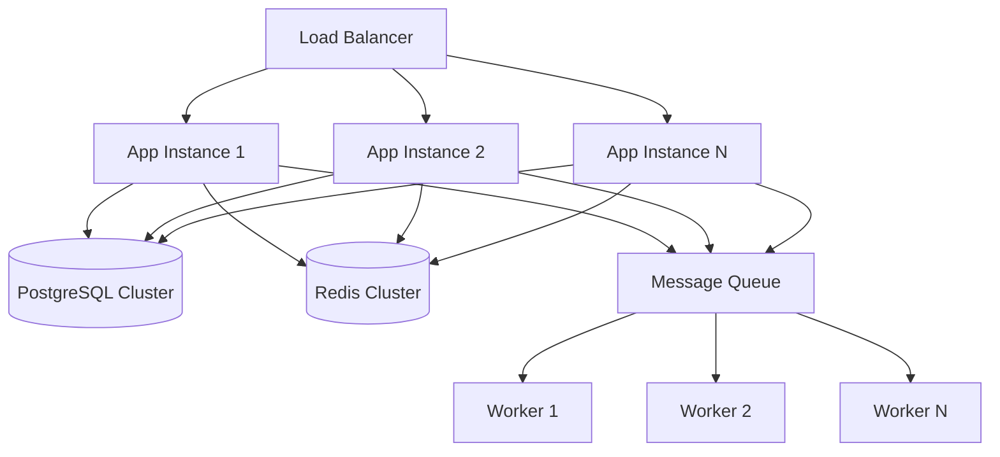

# 📈 Enterprise Scaling Guide
## Telegram Audio Downloader - Horizontal & Vertical Scaling

### 🎯 Overview

This guide covers enterprise-level scaling strategies for the Telegram Audio Downloader, including horizontal scaling, vertical scaling, auto-scaling, and performance optimization for high-throughput environments.

## 🏗️ Scaling Architecture

### Current Architecture Limits

```yaml
Single Instance Limits:
  Max Concurrent Downloads: 20
  Memory Usage: ~500MB
  CPU Usage: 2-4 cores
  Throughput: ~100 files/hour
  Database Connections: 20

Target Enterprise Scale:
  Concurrent Downloads: 1000+
  Instances: 10-50
  Throughput: 10,000+ files/hour
  Database Connections: 500+
  Redis Connections: 200+
```

### Scaling Strategies



## 📊 Horizontal Scaling

### 1. Kubernetes Horizontal Pod Autoscaler

```yaml
# k8s/hpa-advanced.yaml
apiVersion: autoscaling/v2
kind: HorizontalPodAutoscaler
metadata:
  name: telegram-audio-hpa
spec:
  scaleTargetRef:
    apiVersion: apps/v1
    kind: Deployment
    name: telegram-audio-app
  minReplicas: 5
  maxReplicas: 50
  metrics:
  - type: Resource
    resource:
      name: cpu
      target:
        type: Utilization
        averageUtilization: 60
  - type: Resource
    resource:
      name: memory
      target:
        type: Utilization
        averageUtilization: 70
  - type: Pods
    pods:
      metric:
        name: active_downloads
      target:
        type: AverageValue
        averageValue: "10"
  behavior:
    scaleDown:
      stabilizationWindowSeconds: 300
      policies:
      - type: Percent
        value: 50
        periodSeconds: 60
    scaleUp:
      stabilizationWindowSeconds: 60
      policies:
      - type: Percent
        value: 100
        periodSeconds: 30
      - type: Pods
        value: 5
        periodSeconds: 30
      selectPolicy: Max
```

### 2. Custom Metrics for Scaling

```python
# metrics/custom_metrics.py
from prometheus_client import Gauge, Counter, Histogram
import asyncio

# Custom metrics for scaling decisions
active_downloads_gauge = Gauge('telegram_audio_active_downloads', 'Number of active downloads')
queue_size_gauge = Gauge('telegram_audio_queue_size', 'Size of download queue')
download_duration = Histogram('telegram_audio_download_duration_seconds', 'Download duration')
download_rate = Counter('telegram_audio_downloads_total', 'Total downloads completed')

class ScalingMetrics:
    """Metrics collector for scaling decisions."""
    
    def __init__(self):
        self.active_downloads = 0
        self.queue_size = 0
        
    async def update_metrics(self):
        """Update metrics for scaling decisions."""
        while True:
            # Update active downloads
            active_downloads_gauge.set(self.active_downloads)
            
            # Update queue size
            queue_size = await self.get_queue_size()
            queue_size_gauge.set(queue_size)
            
            # Calculate scaling recommendation
            scaling_factor = self.calculate_scaling_factor()
            
            await asyncio.sleep(10)  # Update every 10 seconds
    
    def calculate_scaling_factor(self) -> float:
        """Calculate recommended scaling factor."""
        if self.queue_size > 100:
            return 2.0  # Scale up aggressively
        elif self.queue_size > 50:
            return 1.5  # Scale up moderately
        elif self.queue_size < 10 and self.active_downloads < 5:
            return 0.5  # Scale down
        return 1.0  # No scaling needed
```

### 3. Load Balancer Configuration

```nginx
# nginx-scaling.conf
upstream telegram_audio_backend {
    least_conn;
    server app1:8080 weight=1 max_fails=3 fail_timeout=30s;
    server app2:8080 weight=1 max_fails=3 fail_timeout=30s;
    server app3:8080 weight=1 max_fails=3 fail_timeout=30s;
    
    # Auto-scaling targets
    server app4:8080 weight=1 max_fails=3 fail_timeout=30s backup;
    server app5:8080 weight=1 max_fails=3 fail_timeout=30s backup;
}

server {
    listen 80;
    
    # Connection pooling
    upstream_keepalive_connections 32;
    upstream_keepalive_requests 1000;
    upstream_keepalive_timeout 60s;
    
    location / {
        proxy_pass http://telegram_audio_backend;
        proxy_set_header Host $host;
        proxy_set_header X-Real-IP $remote_addr;
        proxy_set_header X-Forwarded-For $proxy_add_x_forwarded_for;
        
        # Load balancing headers
        proxy_set_header X-Instance-ID $upstream_addr;
        
        # Timeouts for scaling
        proxy_connect_timeout 5s;
        proxy_send_timeout 60s;
        proxy_read_timeout 60s;
    }
    
    # Health check endpoint
    location /health {
        access_log off;
        proxy_pass http://telegram_audio_backend/health;
        proxy_connect_timeout 2s;
        proxy_send_timeout 2s;
        proxy_read_timeout 2s;
    }
}
```

### 4. Database Scaling

```yaml
# PostgreSQL Cluster Configuration
postgresql:
  replication:
    enabled: true
    readReplicas: 3
    synchronousCommit: "on"
    maxConnections: 500
    
  pooling:
    enabled: true
    pgbouncer:
      poolSize: 100
      maxClientConnections: 1000
      defaultPoolSize: 50
      
  sharding:
    enabled: true
    shardKey: "user_id"
    shards:
      - name: "shard1"
        weight: 33
      - name: "shard2" 
        weight: 33
      - name: "shard3"
        weight: 34
```

## ⬆️ Vertical Scaling

### 1. Resource Optimization

```yaml
# k8s/deployment-optimized.yaml
apiVersion: apps/v1
kind: Deployment
metadata:
  name: telegram-audio-app-optimized
spec:
  replicas: 3
  template:
    spec:
      containers:
      - name: app
        image: telegram-audio-downloader:latest
        resources:
          requests:
            memory: "1Gi"
            cpu: "1000m"
            ephemeral-storage: "2Gi"
          limits:
            memory: "4Gi"
            cpu: "2000m"
            ephemeral-storage: "10Gi"
        env:
        - name: WORKERS
          value: "8"
        - name: MAX_CONCURRENT_DOWNLOADS
          value: "20"
        - name: MEMORY_LIMIT
          value: "3Gi"
```

### 2. Memory Optimization

```python
# memory/optimization.py
import gc
import asyncio
from memory_profiler import profile

class MemoryOptimizer:
    """Memory optimization for vertical scaling."""
    
    def __init__(self, max_memory_mb: int = 3000):
        self.max_memory_mb = max_memory_mb
        self.cleanup_threshold = max_memory_mb * 0.8
        
    async def monitor_memory(self):
        """Monitor and optimize memory usage."""
        while True:
            current_memory = self.get_memory_usage()
            
            if current_memory > self.cleanup_threshold:
                await self.aggressive_cleanup()
            elif current_memory > self.max_memory_mb * 0.6:
                await self.moderate_cleanup()
                
            await asyncio.sleep(30)
    
    async def aggressive_cleanup(self):
        """Aggressive memory cleanup."""
        # Force garbage collection
        gc.collect()
        
        # Clear caches
        await self.clear_download_cache()
        await self.clear_metadata_cache()
        
        # Reduce concurrent operations
        await self.reduce_concurrency()
        
    @profile
    async def memory_efficient_download(self, url: str, chunk_size: int = 1024*1024):
        """Memory-efficient download with streaming."""
        async with aiohttp.ClientSession() as session:
            async with session.get(url) as response:
                with open(filename, 'wb') as f:
                    async for chunk in response.content.iter_chunked(chunk_size):
                        f.write(chunk)
                        # Yield control to prevent memory accumulation
                        await asyncio.sleep(0)
```

### 3. CPU Optimization

```python
# cpu/optimization.py
import asyncio
import multiprocessing
from concurrent.futures import ProcessPoolExecutor

class CPUOptimizer:
    """CPU optimization for vertical scaling."""
    
    def __init__(self):
        self.cpu_count = multiprocessing.cpu_count()
        self.process_pool = ProcessPoolExecutor(max_workers=self.cpu_count)
        
    async def cpu_intensive_task(self, task_data):
        """Run CPU-intensive tasks in separate processes."""
        loop = asyncio.get_event_loop()
        
        # Offload to process pool
        result = await loop.run_in_executor(
            self.process_pool,
            self.process_audio_file,
            task_data
        )
        
        return result
    
    def process_audio_file(self, file_path: str):
        """CPU-intensive audio processing."""
        # Metadata extraction, format conversion, etc.
        # This runs in a separate process
        pass
```

## 🔄 Auto-Scaling Implementation

### 1. Custom Auto-Scaler

```python
# autoscaler/controller.py
import asyncio
import kubernetes
from typing import Dict, List

class AutoScaler:
    """Custom auto-scaling controller."""
    
    def __init__(self, namespace: str = "telegram-audio"):
        self.k8s_client = kubernetes.client.AppsV1Api()
        self.namespace = namespace
        self.target_cpu_utilization = 60
        self.target_memory_utilization = 70
        
    async def scale_controller(self):
        """Main scaling control loop."""
        while True:
            try:
                metrics = await self.get_metrics()
                scaling_decision = self.make_scaling_decision(metrics)
                
                if scaling_decision['action'] != 'none':
                    await self.execute_scaling(scaling_decision)
                    
            except Exception as e:
                print(f"Scaling error: {e}")
                
            await asyncio.sleep(60)  # Check every minute
    
    async def get_metrics(self) -> Dict:
        """Get current metrics for scaling decision."""
        return {
            'cpu_utilization': await self.get_cpu_utilization(),
            'memory_utilization': await self.get_memory_utilization(),
            'active_downloads': await self.get_active_downloads(),
            'queue_size': await self.get_queue_size(),
            'current_replicas': await self.get_current_replicas()
        }
    
    def make_scaling_decision(self, metrics: Dict) -> Dict:
        """Make scaling decision based on metrics."""
        current_replicas = metrics['current_replicas']
        
        # Scale up conditions
        if (metrics['cpu_utilization'] > 80 or 
            metrics['memory_utilization'] > 85 or
            metrics['queue_size'] > 100):
            return {
                'action': 'scale_up',
                'target_replicas': min(current_replicas * 2, 50)
            }
        
        # Scale down conditions
        elif (metrics['cpu_utilization'] < 30 and 
              metrics['memory_utilization'] < 40 and
              metrics['queue_size'] < 10):
            return {
                'action': 'scale_down',
                'target_replicas': max(current_replicas // 2, 3)
            }
        
        return {'action': 'none'}
    
    async def execute_scaling(self, decision: Dict):
        """Execute scaling decision."""
        deployment_name = "telegram-audio-app"
        
        # Update deployment
        body = {
            'spec': {
                'replicas': decision['target_replicas']
            }
        }
        
        self.k8s_client.patch_namespaced_deployment_scale(
            name=deployment_name,
            namespace=self.namespace,
            body=body
        )
        
        print(f"Scaled to {decision['target_replicas']} replicas")
```

### 2. Predictive Scaling

```python
# autoscaler/predictive.py
import numpy as np
from sklearn.linear_model import LinearRegression
import asyncio

class PredictiveScaler:
    """Predictive auto-scaling based on historical patterns."""
    
    def __init__(self):
        self.model = LinearRegression()
        self.history = []
        
    async def collect_metrics(self):
        """Collect metrics for prediction."""
        while True:
            metrics = {
                'timestamp': time.time(),
                'cpu_usage': await get_cpu_usage(),
                'memory_usage': await get_memory_usage(),
                'download_rate': await get_download_rate(),
                'queue_size': await get_queue_size()
            }
            
            self.history.append(metrics)
            
            # Keep only last 24 hours
            cutoff_time = time.time() - 86400
            self.history = [m for m in self.history if m['timestamp'] > cutoff_time]
            
            await asyncio.sleep(60)
    
    def predict_load(self, minutes_ahead: int = 15) -> Dict:
        """Predict load for next N minutes."""
        if len(self.history) < 10:
            return {'cpu': 50, 'memory': 50, 'queue': 0}
        
        # Prepare features (time-based patterns)
        X = np.array([[h['timestamp'] % 86400] for h in self.history])  # Time of day
        
        # Predict CPU usage
        y_cpu = np.array([h['cpu_usage'] for h in self.history])
        self.model.fit(X, y_cpu)
        future_time = (time.time() + minutes_ahead * 60) % 86400
        predicted_cpu = self.model.predict([[future_time]])[0]
        
        # Predict memory usage
        y_memory = np.array([h['memory_usage'] for h in self.history])
        self.model.fit(X, y_memory)
        predicted_memory = self.model.predict([[future_time]])[0]
        
        return {
            'cpu': max(0, min(100, predicted_cpu)),
            'memory': max(0, min(100, predicted_memory)),
            'confidence': self.calculate_confidence()
        }
    
    def calculate_recommended_replicas(self, prediction: Dict) -> int:
        """Calculate recommended replicas based on prediction."""
        if prediction['confidence'] < 0.7:
            return 0  # Don't scale if confidence is low
        
        if prediction['cpu'] > 75 or prediction['memory'] > 80:
            return +2  # Scale up
        elif prediction['cpu'] < 25 and prediction['memory'] < 30:
            return -1  # Scale down
        
        return 0  # No change
```

## 📊 Performance Monitoring for Scaling

### 1. Scaling Metrics Dashboard

```python
# monitoring/scaling_dashboard.py
from flask import Flask, jsonify, render_template
import asyncio

app = Flask(__name__)

class ScalingDashboard:
    """Dashboard for monitoring scaling metrics."""
    
    @app.route('/scaling/metrics')
    async def get_scaling_metrics():
        """Get current scaling metrics."""
        return jsonify({
            'current_replicas': await get_current_replicas(),
            'target_replicas': await get_target_replicas(),
            'cpu_utilization': await get_avg_cpu_utilization(),
            'memory_utilization': await get_avg_memory_utilization(),
            'scaling_events': await get_recent_scaling_events(),
            'performance_metrics': {
                'downloads_per_second': await get_downloads_per_second(),
                'avg_response_time': await get_avg_response_time(),
                'error_rate': await get_error_rate()
            }
        })
    
    @app.route('/scaling/recommendations')
    async def get_scaling_recommendations():
        """Get scaling recommendations."""
        predictor = PredictiveScaler()
        prediction = predictor.predict_load(15)
        
        return jsonify({
            'prediction': prediction,
            'recommended_action': predictor.calculate_recommended_replicas(prediction),
            'reasoning': generate_scaling_reasoning(prediction)
        })
```

### 2. Scaling Alerts

```yaml
# monitoring/scaling-alerts.yml
groups:
  - name: scaling-alerts
    rules:
      - alert: ScalingEventHigh
        expr: increase(kubernetes_deployment_spec_replicas[5m]) > 5
        for: 1m
        labels:
          severity: warning
        annotations:
          summary: "Rapid scaling up detected"
          description: "Deployment scaled up by {{ $value }} replicas in 5 minutes"

      - alert: ScalingThrashing
        expr: changes(kubernetes_deployment_spec_replicas[30m]) > 10
        for: 5m
        labels:
          severity: critical
        annotations:
          summary: "Scaling thrashing detected"
          description: "Deployment scaled {{ $value }} times in 30 minutes"

      - alert: MaxReplicasReached
        expr: kubernetes_deployment_spec_replicas >= 50
        for: 1m
        labels:
          severity: critical
        annotations:
          summary: "Maximum replicas reached"
          description: "Deployment has reached maximum replica count"
```

## 🎯 Scaling Best Practices

### 1. Scaling Policies

```yaml
# Scaling Configuration
scaling_policies:
  conservative:
    scale_up:
      cpu_threshold: 80
      memory_threshold: 85
      cooldown: 300s
      max_scale_factor: 1.5
    scale_down:
      cpu_threshold: 30
      memory_threshold: 40
      cooldown: 600s
      max_scale_factor: 0.7
      
  aggressive:
    scale_up:
      cpu_threshold: 70
      memory_threshold: 75
      cooldown: 120s
      max_scale_factor: 2.0
    scale_down:
      cpu_threshold: 40
      memory_threshold: 50
      cooldown: 300s
      max_scale_factor: 0.8
```

### 2. Resource Planning

```python
# Resource planning calculator
class ResourcePlanner:
    """Calculate required resources for target throughput."""
    
    def calculate_required_resources(self, target_throughput: int) -> Dict:
        """Calculate resources needed for target downloads per hour."""
        
        # Base metrics per instance
        base_throughput = 100  # downloads per hour per instance
        base_cpu = 1000  # millicores
        base_memory = 500  # MB
        
        # Calculate required instances
        required_instances = math.ceil(target_throughput / base_throughput)
        
        # Add overhead and safety margin
        safety_margin = 1.3
        required_instances = int(required_instances * safety_margin)
        
        return {
            'instances': required_instances,
            'total_cpu_cores': (required_instances * base_cpu) / 1000,
            'total_memory_gb': (required_instances * base_memory) / 1024,
            'estimated_cost_per_hour': required_instances * 0.1,  # $0.1 per instance
            'database_connections': required_instances * 20,
            'redis_connections': required_instances * 10
        }
```

## 📈 Performance Benchmarks by Scale

### Scaling Performance Targets

```yaml
Scale Targets:
  Small (1-3 instances):
    Throughput: 100-300 downloads/hour
    Latency: <100ms
    Memory: <500MB per instance
    CPU: <2 cores total
    
  Medium (3-10 instances):
    Throughput: 300-1000 downloads/hour
    Latency: <150ms
    Memory: <5GB total
    CPU: <10 cores total
    
  Large (10-25 instances):
    Throughput: 1000-2500 downloads/hour
    Latency: <200ms
    Memory: <25GB total
    CPU: <50 cores total
    
  Enterprise (25-50 instances):
    Throughput: 2500-5000 downloads/hour
    Latency: <300ms
    Memory: <100GB total
    CPU: <100 cores total
```

---

## 🔧 Troubleshooting Scaling Issues

### Common Scaling Problems

1. **Scaling Thrashing**: Too frequent scaling events
   - Solution: Increase cooldown periods
   - Implement smoothed metrics

2. **Database Connection Limits**: Connection pool exhaustion
   - Solution: Implement connection pooling
   - Use read replicas

3. **Memory Leaks During Scale-Up**: Memory not released
   - Solution: Implement proper cleanup
   - Monitor memory patterns

4. **Cold Start Delays**: New instances slow to start
   - Solution: Implement warm instances
   - Optimize startup time

### Scaling Monitoring Commands

```bash
# Monitor scaling events
kubectl get events --field-selector reason=SuccessfulCreate
kubectl get events --field-selector reason=SuccessfulDelete

# Check HPA status
kubectl get hpa telegram-audio-hpa -o yaml

# Monitor resource usage
kubectl top pods -l app=telegram-audio
kubectl top nodes

# Check scaling metrics
curl http://prometheus:9090/api/v1/query?query=kubernetes_deployment_spec_replicas
```

This comprehensive scaling guide provides enterprise-level strategies for handling high-throughput scenarios with the Telegram Audio Downloader.