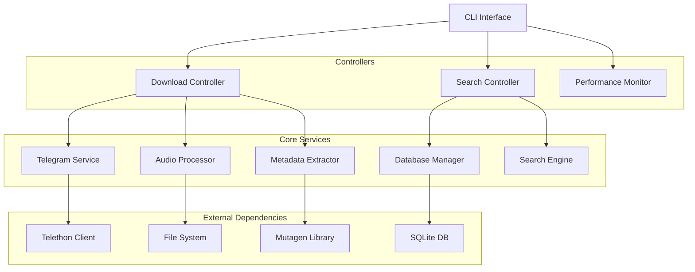

# 🏗️ Architecture Overview

Eine detaillierte Übersicht über die technische Architektur des Telegram Audio Downloaders.

## 📋 **Inhaltsverzeichnis**

- [System-Architektur](#system-architektur)
- [Komponenten-Diagramm](#komponenten-diagramm)
- [Datenfluss](#datenfluss)
- [Technologie-Stack](#technologie-stack)
- [Design-Patterns](#design-patterns)
- [Performance-Architektur](#performance-architektur)

---

## 🏛️ **System-Architektur**

### **Überblick**
Das System folgt einer **modularen, event-driven Architektur** mit klarer Trennung von Verantwortlichkeiten:

```
┌─────────────────────────────────────────────────────────────┐
│                    CLI Interface Layer                      │
│  ┌─────────────┐ ┌─────────────┐ ┌─────────────────────────┐│
│  │   Click     │ │    Rich     │ │    Argument Parser      ││
│  │   Commands  │ │    UI       │ │    & Validation         ││
│  └─────────────┘ └─────────────┘ └─────────────────────────┘│
└─────────────────────────────────────────────────────────────┘
                              │
                              ▼
┌─────────────────────────────────────────────────────────────┐
│                   Application Layer                         │
│  ┌─────────────┐ ┌─────────────┐ ┌─────────────────────────┐│
│  │ Download    │ │   Search    │ │   Performance           ││
│  │ Controller  │ │ Controller  │ │   Monitor               ││
│  └─────────────┘ └─────────────┘ └─────────────────────────┘│
└─────────────────────────────────────────────────────────────┘
                              │
                              ▼
┌─────────────────────────────────────────────────────────────┐
│                    Service Layer                            │
│  ┌─────────────┐ ┌─────────────┐ ┌─────────────────────────┐│
│  │  Telegram   │ │   Audio     │ │    Metadata             ││
│  │  Service    │ │  Processor  │ │    Extractor            ││
│  └─────────────┘ └─────────────┘ └─────────────────────────┘│
└─────────────────────────────────────────────────────────────┘
                              │
                              ▼
┌─────────────────────────────────────────────────────────────┐
│                    Data Layer                               │
│  ┌─────────────┐ ┌─────────────┐ ┌─────────────────────────┐│
│  │   SQLite    │ │File System │ │    Configuration        ││
│  │  Database   │ │   Storage   │ │    Manager              ││
│  └─────────────┘ └─────────────┘ └─────────────────────────┘│
└─────────────────────────────────────────────────────────────┘
```

### **Architektur-Prinzipien**

1. **📦 Separation of Concerns**
   - Jede Schicht hat klare Verantwortlichkeiten
   - Lose Kopplung zwischen Komponenten
   - High Cohesion innerhalb der Module

2. **🔄 Dependency Injection**
   - Services werden über Interfaces injiziert
   - Testbarkeit durch Mock-Objekte
   - Flexibilität bei der Konfiguration

3. **⚡ Asynchrone Architektur**
   - Async/Await für I/O-Operationen
   - Parallele Downloads mit asyncio
   - Non-blocking User Interface

4. **🛡️ Error-First Design**
   - Robuste Fehlerbehandlung auf allen Ebenen
   - Retry-Mechanismen mit exponential backoff
   - Graceful degradation bei Teilausfällen

---

## 🧩 **Komponenten-Diagramm**

### **Haupt-Komponenten**



### **Datenbank-Schema**

```sql
-- Downloads-Tracking
CREATE TABLE downloads (
    id INTEGER PRIMARY KEY,
    message_id INTEGER NOT NULL,
    group_name TEXT NOT NULL,
    file_name TEXT NOT NULL,
    file_size INTEGER,
    download_path TEXT NOT NULL,
    checksum TEXT,
    metadata_json TEXT,
    created_at TIMESTAMP DEFAULT CURRENT_TIMESTAMP,
    status TEXT DEFAULT 'completed'
);

-- Performance-Metriken
CREATE TABLE performance_metrics (
    id INTEGER PRIMARY KEY,
    metric_name TEXT NOT NULL,
    metric_value REAL NOT NULL,
    timestamp TIMESTAMP DEFAULT CURRENT_TIMESTAMP
);

-- Gruppen-Metadaten
CREATE TABLE groups_metadata (
    id INTEGER PRIMARY KEY,
    group_name TEXT UNIQUE NOT NULL,
    group_id INTEGER,
    total_messages INTEGER DEFAULT 0,
    last_scan TIMESTAMP,
    active BOOLEAN DEFAULT 1
);
```

---

## 🌊 **Datenfluss**

### **Download-Workflow**

```
User Command → CLI Parser → Download Controller
     │
     ▼
Telegram Service ← API Credentials ← Config Manager
     │
     ▼
Message Filtering → Audio Detection → File Validation
     │
     ▼  
Download Queue → Parallel Workers → Progress Tracking
     │
     ▼
File Storage → Metadata Extraction → Database Update
     │
     ▼
Checksum Verification → Status Report → User Feedback
```

### **Search-Workflow**

```
Search Query → Query Parser → Search Controller
     │
     ▼
Database Query ← Search Index ← Metadata Cache
     │
     ▼
Fuzzy Matching → Result Ranking → Format Filtering
     │
     ▼
Result Assembly → Rich Display → User Output
```

---

## 🛠️ **Technologie-Stack**

### **Core-Technologies**
- **🐍 Python 3.11+**: Moderne Python-Features mit Type Hints
- **⚡ asyncio**: Asynchrone Programmierung für Performance
- **📡 Telethon**: Telegram MTProto API Client
- **🗄️ SQLite**: Embedded Database für Metadaten
- **🎵 Mutagen**: Audio-Metadaten-Extraktion

### **CLI & UI**
- **🖱️ Click**: Command-Line Interface Framework
- **🎨 Rich**: Rich Terminal UI mit Progress Bars
- **📝 Typer**: Type-annotated CLI (Alternative zu Click)

### **Development & Quality**
- **🧪 pytest**: Unit Testing Framework
- **📊 pytest-cov**: Coverage Reporting
- **⚡ pytest-asyncio**: Async Test Support
- **🎭 pytest-mock**: Mocking Framework

### **Code Quality**
- **⚫ black**: Code Formatting
- **📦 isort**: Import Sorting
- **🔍 flake8**: Linting
- **🏷️ mypy**: Static Type Checking
- **🔒 bandit**: Security Analysis

---

## 🎯 **Design-Patterns**

### **1. Repository Pattern**
```python
class DownloadRepository:
    """Abstracts database operations for downloads."""
    
    async def save_download(self, download: Download) -> int
    async def find_by_checksum(self, checksum: str) -> Optional[Download]
    async def get_recent_downloads(self, limit: int) -> List[Download]
```

### **2. Factory Pattern**
```python
class TelegramClientFactory:
    """Creates configured Telegram clients."""
    
    def create_client(self, config: Config) -> TelegramClient
    def create_authenticated_client(self, session: str) -> TelegramClient
```

### **3. Observer Pattern**
```python
class ProgressObserver:
    """Observes download progress for UI updates."""
    
    def on_progress_update(self, downloaded: int, total: int) -> None
    def on_download_complete(self, download: Download) -> None
    def on_error(self, error: Exception) -> None
```

### **4. Strategy Pattern**
```python
class SearchStrategy(ABC):
    """Abstract search strategy."""
    
    @abstractmethod
    async def search(self, query: str) -> List[SearchResult]

class FuzzySearchStrategy(SearchStrategy):
    """Implements fuzzy matching search."""
    
class ExactSearchStrategy(SearchStrategy):
    """Implements exact matching search."""
```

### **5. Dependency Injection**
```python
@dataclass
class AppContainer:
    """Dependency injection container."""
    
    telegram_service: TelegramService
    database_manager: DatabaseManager
    audio_processor: AudioProcessor
    metadata_extractor: MetadataExtractor
```

---

## 🚀 **Performance-Architektur**

### **Async/Await-Modell**

```python
# Parallele Downloads mit semaphore-controlled concurrency
semaphore = asyncio.Semaphore(max_concurrent_downloads)

async def download_worker(client, message, output_dir):
    async with semaphore:
        # Download-Logik hier
        pass

# Parallel execution
tasks = [download_worker(client, msg, output_dir) for msg in messages]
await asyncio.gather(*tasks, return_exceptions=True)
```

### **Rate-Limiting-Algorithmus**

```python
class TokenBucket:
    """Token bucket algorithm for rate limiting."""
    
    def __init__(self, capacity: int, refill_rate: float):
        self.capacity = capacity
        self.tokens = capacity
        self.refill_rate = refill_rate
        self.last_refill = time.time()
    
    async def acquire(self) -> None:
        while not self._try_acquire():
            await asyncio.sleep(0.1)
    
    def _try_acquire(self) -> bool:
        self._refill()
        if self.tokens >= 1:
            self.tokens -= 1
            return True
        return False
```

### **Memory-Management**

```python
class MemoryManager:
    """Manages memory usage during downloads."""
    
    def __init__(self, max_memory_mb: int = 1024):
        self.max_memory = max_memory_mb * 1024 * 1024
    
    def check_memory_usage(self) -> float:
        process = psutil.Process()
        return process.memory_info().rss
    
    async def enforce_memory_limit(self) -> None:
        if self.check_memory_usage() > self.max_memory:
            gc.collect()  # Force garbage collection
            await asyncio.sleep(0.1)  # Allow memory to be freed
```

### **Caching-Strategien**

```python
# LRU Cache für Metadaten
from functools import lru_cache

@lru_cache(maxsize=1000)
def get_cached_metadata(file_path: str) -> Optional[AudioMetadata]:
    """Caches metadata extraction results."""
    pass

# Database-Level Caching
class CachedDatabaseManager:
    def __init__(self):
        self._cache: Dict[str, Any] = {}
        self._cache_ttl: Dict[str, float] = {}
```

---

## 🔄 **Datenbank-Architektur**

### **Schema-Evolution**
```python
# Migration System
class DatabaseMigration:
    version: int
    description: str
    
    async def up(self, db: Database) -> None:
        """Apply migration."""
        pass
    
    async def down(self, db: Database) -> None:
        """Rollback migration."""
        pass

# Migration Manager
class MigrationManager:
    def __init__(self, db: Database):
        self.db = db
        self.migrations = self._load_migrations()
    
    async def migrate_to_latest(self) -> None:
        current_version = await self._get_current_version()
        for migration in self.migrations[current_version:]:
            await migration.up(self.db)
```

### **Query-Optimierung**
```sql
-- Indizes für Performance
CREATE INDEX idx_downloads_group_name ON downloads(group_name);
CREATE INDEX idx_downloads_created_at ON downloads(created_at);
CREATE INDEX idx_downloads_checksum ON downloads(checksum);

-- Full-Text Search Index
CREATE VIRTUAL TABLE downloads_fts USING fts5(
    file_name, 
    metadata_json,
    content='downloads'
);
```

---

## 🧪 **Testing-Architektur**

### **Test-Pyramide**

```
               ┌─────────────────┐
               │   E2E Tests     │  <- Wenige, aber kritische Workflows
               │    (5-10%)      │
               └─────────────────┘
            ┌─────────────────────────┐
            │   Integration Tests     │  <- Service-zu-Service Tests
            │      (20-30%)          │
            └─────────────────────────┘
         ┌─────────────────────────────────┐
         │        Unit Tests               │  <- Einzelne Funktionen/Methoden
         │        (60-70%)                │
         └─────────────────────────────────┘
```

### **Test-Struktur**
```
tests/
├── unit/                    # Unit Tests
│   ├── test_telegram_service.py
│   ├── test_audio_processor.py
│   └── test_metadata_extractor.py
├── integration/             # Integration Tests  
│   ├── test_download_workflow.py
│   └── test_database_operations.py
├── performance/             # Performance Tests
│   ├── test_parallel_downloads.py
│   └── test_memory_usage.py
└── fixtures/                # Test Data
    ├── sample_audio_files/
    └── mock_responses/
```

---

## 🔧 **Configuration-Management**

### **Hierarchische Konfiguration**

```python
# Konfiguration Prioritäten (höchste zu niedrigste)
1. Command-line Arguments    # --parallel=5
2. Environment Variables     # TELEGRAM_API_ID=123
3. .env File                # API_ID=456  
4. Config File (YAML/JSON)  # config.yaml
5. Default Values           # Built-in defaults

class ConfigManager:
    def __init__(self):
        self.config = self._load_config()
    
    def _load_config(self) -> Config:
        # Load from multiple sources in priority order
        config = self._load_defaults()
        config.update(self._load_config_file())
        config.update(self._load_env_vars())
        config.update(self._load_cli_args())
        return config
```

---

## 📈 **Monitoring & Observability**

### **Metriken-System**
```python
class MetricsCollector:
    """Sammelt und berichtet Performance-Metriken."""
    
    def record_download_time(self, duration: float) -> None
    def record_file_size(self, size: int) -> None  
    def record_error(self, error_type: str) -> None
    def record_memory_usage(self, usage_mb: float) -> None
    
    async def export_metrics(self) -> Dict[str, Any]:
        """Exportiert Metriken für externe Systeme."""
        pass
```

### **Logging-Architektur**
```python
# Strukturiertes Logging mit Context
logger = structlog.get_logger(__name__)

await logger.ainfo(
    "download_completed",
    file_name=file_name,
    file_size=file_size,
    duration_ms=duration,
    group_name=group_name
)
```

---

## 🚀 **Deployment-Architektur**

### **Container-Strategie**
```dockerfile
# Multi-stage build für optimale Image-Größe
FROM python:3.11-slim as builder
COPY requirements.txt .
RUN pip install --user -r requirements.txt

FROM python:3.11-slim
COPY --from=builder /root/.local /root/.local
COPY . /app
WORKDIR /app
```

### **Environment-Konfiguration**
```yaml
# docker-compose.yml für verschiedene Environments
version: '3.8'
services:
  telegram-downloader:
    image: telegram-audio-downloader:latest
    environment:
      - ENVIRONMENT=${ENV:-development}
      - LOG_LEVEL=${LOG_LEVEL:-INFO}
    volumes:
      - ./downloads:/app/downloads
      - ./data:/app/data
```

---

## 📊 **Skalierungs-Strategien**

### **Horizontale Skalierung**
- **Multi-Instance Deployment**: Mehrere Container-Instanzen
- **Load Balancing**: Request-Verteilung zwischen Instanzen  
- **Shared Storage**: Gemeinsamer Download-Speicher
- **Database Sharding**: Verteilung der Datenbank-Last

### **Performance-Optimierung**
- **Connection Pooling**: Wiederverwendung von Telegram-Verbindungen
- **Batch Processing**: Verarbeitung mehrerer Files gleichzeitig
- **Lazy Loading**: Metadaten nur bei Bedarf laden
- **Compression**: Komprimierung von Logs und Metriken

---

## 🔮 **Zukunfts-Architektur**

### **Geplante Erweiterungen**
- **🌐 Web Interface**: React-basierte Web-UI
- **📱 Mobile API**: REST API für mobile Apps
- **☁️ Cloud Integration**: AWS S3/Google Drive Upload
- **🔄 Real-time Sync**: WebSocket-basierte Live-Updates
- **🤖 ML Integration**: Audio-Klassifizierung mit Machine Learning

### **Micro-Services Evolution**
```
┌─────────────┐ ┌─────────────┐ ┌─────────────┐
│ Download    │ │ Metadata    │ │ Search      │
│ Service     │ │ Service     │ │ Service     │
└─────────────┘ └─────────────┘ └─────────────┘
       │               │               │
       └───────────────┼───────────────┘
                       │
               ┌─────────────┐
               │   API       │
               │  Gateway    │
               └─────────────┘
```

---

## 🛡️ **Security-Architektur**

### **Threat Model**
- **🔑 Credential Exposure**: API Keys, Session Files
- **📁 File System Access**: Download Directory Permissions  
- **🌐 Network Security**: MITM Attacks, Certificate Validation
- **💾 Data Integrity**: File Corruption, Malicious Content

### **Security Measures**
```python
# Credential Security
class SecureCredentialManager:
    def __init__(self):
        self.keyring = keyring.get_keyring()
    
    def store_credentials(self, service: str, credentials: dict) -> None:
        encrypted_data = self._encrypt(json.dumps(credentials))
        self.keyring.set_password(service, "telegram_app", encrypted_data)
    
    def _encrypt(self, data: str) -> str:
        # Use cryptography library for encryption
        pass

# Input Validation
def validate_group_name(group_name: str) -> str:
    """Validates and sanitizes group names."""
    if not re.match(r'^[@\w\-\s]+$', group_name):
        raise ValueError("Invalid group name format")
    return group_name.strip()
```

---

**Diese Architektur-Dokumentation bietet eine umfassende Übersicht über das System-Design und ist sowohl für Entwickler als auch für technische Stakeholder zugänglich.** 🏗️✨

---

*Letzte Aktualisierung: $(date +%Y-%m-%d) | Version: 1.0*